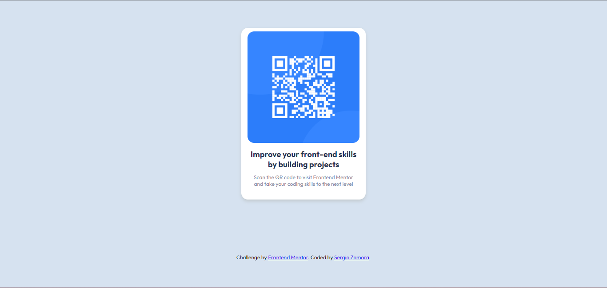
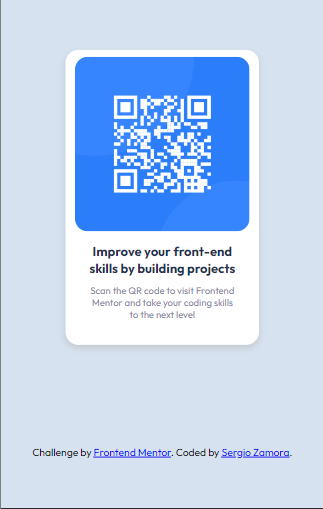

# Frontend Mentor - QR code component solution

This is a solution to the [QR code component challenge on Frontend Mentor](https://www.frontendmentor.io/challenges/qr-code-component-iux_sIO_H). 

## Table of contents

- [Overview](#overview)
  - [Screenshot](#screenshot)
  - [Links](#links)
  - [Built with](#built-with)
- [Author](#author)

## Overview

This is a solution to one of the challenges proposed on the Frontend Mentor page. In my solution I just added a larger font size in the desktop layout. It is a card that contains a QR code that leads to the official Frontend Mentor page.

### Screenshot

### Links

- Solution URL: 
- Live Site URL: 

### Built with

- Semantic HTML5 markup
- CSS custom properties
- Flexbox
- Mobile-first workflow

## Author

- Website - 
- Frontend Mentor - [@yourusername](https://www.frontendmentor.io/profile/yourusername)
